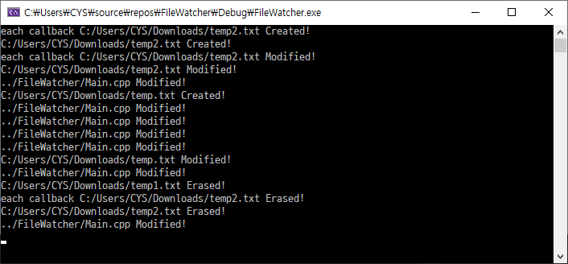

# FileWatcher
FileWatcher is simple file/dir change detection that based c++17

## Feature
 - File&Directory change detection (Directory only support inner file create/remove -> Modified status for dir)
 - Cross platform.
 - Thread safe.
 - 3 File status(Created, Modified, Erased).
 - Support relative/absolute path.
 - Very easy to use & simple. 

### sample code 

```cpp
#include <iostream>
#include <chrono>
#include <fstream>

#include "FileWatcher.h"

using namespace std::chrono_literals;

void callback(std::filesystem::path path, watcher::FileStatus status) {
	switch (status)
	{
	case watcher::FileStatus::Created:
		std::cout << path.string() << " Created!" << std::endl;
		break;
	case watcher::FileStatus::Modified:
		std::cout << path.string() << " Modified!" << std::endl;
		break;
	case watcher::FileStatus::Erased:
		std::cout << path.string() << " Erased!" << std::endl;
		break;
	default:
		std::cout << "error!" << std::endl;
		break;
	}
}

void eachCallback(std::filesystem::path path, watcher::FileStatus status) {
	std::cout << "each callback ";
	switch (status)
	{
	case watcher::FileStatus::Created:
		std::cout << path.string() << " Created!" << std::endl;
		break;
	case watcher::FileStatus::Modified:
		std::cout << path.string() << " Modified!" << std::endl;
		break;
	case watcher::FileStatus::Erased:
		std::cout << path.string() << " Erased!" << std::endl;
		break;
	default:
		std::cout << "error!" << std::endl;
		break;
	}
}

void writeData(std::filesystem::path path) {
	std::filesystem::create_directories(path.parent_path());
	std::ofstream ofs(path, std::ios::app);
	ofs.close();

	std::this_thread::sleep_for(2s);

	std::ofstream ofs2(path, std::ios::app);
	ofs2 << "this is some text in the new file\n";
	ofs2.close();
}

int main() {


	watcher::FileWatchar fileWatchar;

	std::filesystem::path temp("C:/Users/CYS/Downloads/temp.txt"), temp1("C:/Users/CYS/Downloads/temp1.txt"), temp2("C:/Users/CYS/Downloads/temp2.txt");

	std::filesystem::remove_all(temp);
	std::filesystem::remove_all(temp1);
	std::filesystem::remove_all(temp2);	

	// EX) Create file & write data
	writeData(temp1);

	// Add path that want to chage(Created, Modified, Erased)
	// Support watching that not created file.
	fileWatchar.addPath(temp1);

	// Support each callback
	fileWatchar.addPath(temp2, eachCallback);
	fileWatchar.addPath("../FileWatcher/Main.cpp");//x86 // It's ok to write string & relative path
	fileWatchar.addPath("../../FileWatcher/Main.cpp");//x64 // It's ok to write string & relative path

	fileWatchar.start(callback); // Global Callback

	// EX) Create file & write data
	writeData(temp2);

	std::this_thread::sleep_for(5s);
	fileWatchar.addPath(temp);
	writeData(temp);
	std::this_thread::sleep_for(5s);
	fileWatchar.removePath(temp);
	writeData(temp); // not watching

	std::filesystem::remove_all(temp);
	std::filesystem::remove_all(temp1);
	std::filesystem::remove_all(temp2);

	//fileWatchar.stop(); // not essential

	std::this_thread::sleep_for(1000s); // Do something
}
```

### sample image


